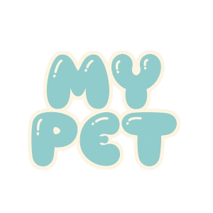

<div align="left">

</div>

## Description
**My Pet** is a virtual pet care application developed in Java that allows users to take care of a virtual pet. Players can feed, groom, play with, and manage the health and happiness of their pet. The application provides educational value by teaching responsibility and routine management through interactive gameplay. Features include multiple pet types, a save/load system, and parental controls.

## Required Libraries and Third-Party Tools
The following libraries and tools are required to run or build **My Pet**:

- **Java 23** or newer (for development and running the software)
- **JUnit 5** (for unit testing)
  - Version: **5.7.0**
- **GSON** (for JSON serialization and deserialization)
  - Version: **2.11.0**
- **JavaFX** (for the GUI)
  - Version: **16** or newer (can be bundled with your IDE or installed separately)
- **Gradle** (for build automation)
  - Version: **7.0** or newer

### Installation of Third-Party Libraries

- **JUnit 5**:
  - Download from the official [JUnit website](https://junit.org/junit5/).

- **GSON**:
  - Download from the [GSON GitHub repository](https://github.com/google/gson).

- **JavaFX**:
  - Download from the [JavaFX website](https://openjfx.io/) or use your IDE's built-in JavaFX support.
  - Add JavaFX libraries to the project classpath if not included by default.

- **Gradle**:
  - Download Gradle from [Gradle's website](https://gradle.org/install/) if it's not already installed on your system.


### Prerequisites
- **Java 23** (or newer)
  -> Check your current version by running java --version
- **Gradle** (for build automation)
- DEVELOPMENT: **IDE** such as **IntelliJ IDEA**, **Eclipse**, or **VS Code**.

### Step-by-Step Guide to Build the Software

1. **Clone the Repository**
   Clone the repository to your local machine using Git:
   ```bash
   git clone https://gitlab.sci.uwo.ca/courses/2024/09/COMPSCI2212/group31

2. **Navigate to the newly installed directory**
   ```bash
   cd ~/group31

3. **Compile the game**
   ```bash
   ./gradlew build

4. **Run the game**
   ```bash
   ./gradlew run

**FIRST TIME USER GUIDE**

_Gameplay_:
- If you are a time first time user, its reccomended to go through the tutorial by clicking on the '_Tutorial_' button and scrolling through the instructions.

- Begin a new game by clicking on the '_Start New_' button and choose a pet. Then choose a name for your pet. This will be your pet for the current save.

- In the middle of the screen is your pet, on the bottom-left are the pet's stats, and on the bottom right is the button to access settings.

- Gameplay consists of the pet's stats decaying over time and you, the player giving commands to the pet, feeding them, giving them gifts, etc. to prevent the stats from getting too low.

- The game is over when the pet's health stat reaches zero. The pet being too hungry slowly decreases health but taking the pet to the vet, feeding it consistently and other actions can raise the health of a pet to avoid this.

_Saving/Loading_:
- To access your current saves, click the 'Load Game' button.

- From here you can start a new save or continue old ones.

_Parental Controls_:
- To access parental controls, click on the 'Parent Zone' button. The password is: password. Use the bottom navigation bar to navigate.

- In the 'time limit' section you can turn on/off a time limit for the player. You can select specific times when the player is allowed to play the game.

- In the 'stats' section, you can check the player's total play time and their average play time. If needed, you can reset these values as well.

- In the 'pet revival' section, you can revive the player's pets if one of them has died. This will restore that save and allow the player to keep playing on it.
